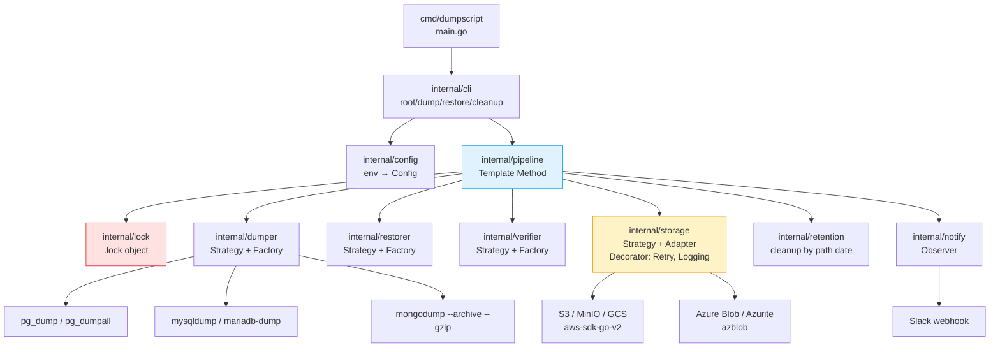
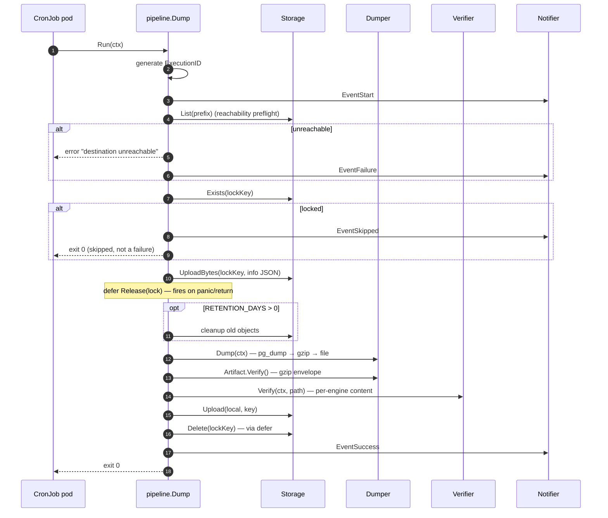
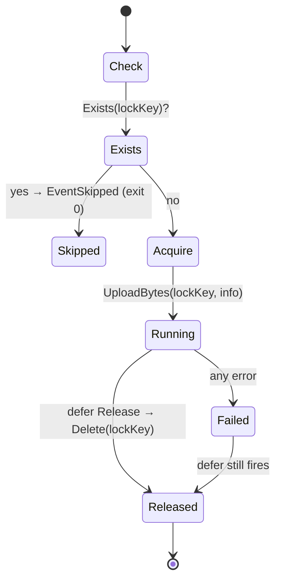

# dumpscript

> Cron-safe database dump & restore tool for PostgreSQL, MySQL, MariaDB and
> MongoDB — uploads to S3-compatible object stores and Azure Blob Storage,
> with distributed locking, per-engine content verification and Slack
> notifications.

[](https://artifacthub.io/packages/helm/cloudscript/dumpscript)
[](https://github.com/cloudscript-technology/helm-charts/tree/main/dumpscript)
[](https://slack.com/marketplace/A096PJ2QBD5-dumpscript-bot)
[](https://cloudscript.com.br)

---

## Table of contents

1. [What it does](#what-it-does)
2. [Feature matrix](#feature-matrix)
3. [Architecture](#architecture)
4. [Pipeline flow](#pipeline-flow)
5. [Quick start](#quick-start)
6. [Configuration](#configuration)
7. [Subcommands](#subcommands)
8. [Storage backends](#storage-backends)
9. [Distributed locking](#distributed-locking)
10. [Content verification](#content-verification)
11. [Retention](#retention)
12. [Slack notifications](#slack-notifications)
13. [Kubernetes operator](#kubernetes-operator)
14. [Image build options](#image-build-options)
15. [Development](#development)
16. [Testing](#testing)
17. [Project layout](#project-layout)
18. [Design patterns](#design-patterns)
19. [License](#license)

---

## What it does

`dumpscript` is a self-contained Go binary that runs inside a Docker/Podman
container (typically a Kubernetes `CronJob`) and performs the following
workflow:

1. **Verifies** the destination storage is reachable before any work.
2. **Acquires** a day-level distributed lock so concurrent runs don't collide.
3. **Dumps** the target database to a gzip stream using the right engine
   client (`pg_dump`, `mariadb-dump`, `mongodump` or `mysqldump`).
4. **Verifies** the dump content per-engine (footer markers / archive magic).
5. **Uploads** the artefact to S3-compatible object storage or Azure Blob.
6. **Notifies** Slack on start / success / failure / skipped.
7. **Releases** the lock on every exit path — including panics.

All configuration is via environment variables (zero-code deployments), and
every supported server version is covered by one image thanks to the forward
compatibility of the newest clients.

---

## Feature matrix

| Capability                  | Detail                                                    |
| --------------------------- | --------------------------------------------------------- |
| **Engines**                 | PostgreSQL, MySQL, MariaDB, MongoDB                       |
| **Postgres versions**       | 9.2 → **18** via `pg_dump 18`                             |
| **MySQL / MariaDB versions**| MySQL 5.7/8.0, MariaDB 10.x/11.x via `mariadb-dump 11.8`  |
| **MongoDB versions**        | 4.0 → 7.0+ via `mongodb-tools` latest                     |
| **Storage backends**        | S3, MinIO, GCS (S3-compat HMAC), Azure Blob, Azurite      |
| **Authentication**          | AWS static keys, IRSA (EKS), SAS token, Shared Key        |
| **Distributed locking**     | Day-level `.lock` object with JSON metadata               |
| **Reachability preflight**  | `List` call before any dump                               |
| **Content verification**    | Footer scan (Postgres/SQL), magic check (Mongo)           |
| **Retention**               | Configurable days; parses date from the object path       |
| **Notifications**           | Slack webhook (start / success / failure / skipped)       |
| **Periodicity**             | `daily`, `weekly`, `monthly`, `yearly`                    |
| **Kubernetes operator**     | `BackupSchedule` and `Restore` CRDs, auto-manages CronJobs |
| **Notifiers**               | Slack, Discord, Teams, Webhook, Stdout                    |
| **Post-upload integrity**   | SHA-256 / CRC32C / size verified against storage metadata |

---

## Architecture



---

## Pipeline flow



---

## Quick start

### Build the image

```sh
# From source
make image                          # Alpine edge + PG 18 (default)
make image-stable                   # Alpine 3.22 + PG 17 (more stable)

# Or build manually
podman build -f docker/Dockerfile -t dumpscript:go-alpine .
```

### Dump a PostgreSQL database to MinIO

```sh
podman run --rm \
  -e DB_TYPE=postgresql \
  -e DB_HOST=mydb.svc.cluster.local \
  -e DB_PORT=5432 \
  -e DB_USER=backup \
  -e DB_PASSWORD=secret \
  -e DB_NAME=app \
  -e STORAGE_BACKEND=s3 \
  -e AWS_REGION=us-east-1 \
  -e S3_BUCKET=my-backups \
  -e S3_PREFIX=postgresql-dumps \
  -e AWS_ACCESS_KEY_ID=... -e AWS_SECRET_ACCESS_KEY=... \
  -e PERIODICITY=daily \
  -e RETENTION_DAYS=30 \
  dumpscript:go-alpine dump
```

Artefact lands at:

```
s3://my-backups/postgresql-dumps/daily/2026/04/23/dump_20260423_120000.sql.gz
```

---

## Configuration

All configuration is via environment variables (parsed with
[`envconfig`](https://github.com/kelseyhightower/envconfig)).

### Database (required)

| Variable       | Default              | Description                                      |
| -------------- | -------------------- | ------------------------------------------------ |
| `DB_TYPE`      | —                    | `postgresql`, `mysql`, `mariadb`, `mongodb`      |
| `DB_HOST`      | —                    | Database host                                    |
| `DB_PORT`      | auto-pick by type    | `5432` pg / `3306` mysql·mariadb / `27017` mongo |
| `DB_USER`      | —                    | Username                                         |
| `DB_PASSWORD`  | —                    | Password                                         |
| `DB_NAME`      | empty = all DBs      | Database name (omit for `pg_dumpall` / `--all-databases`) |
| `DUMP_OPTIONS` | empty                | Extra flags forwarded to the dump/restore client |
| `CREATE_DB`    | `false`              | Restore: create DB if missing before restore     |

### Pipeline / behaviour

| Variable         | Default       | Description                                  |
| ---------------- | ------------- | -------------------------------------------- |
| `PERIODICITY`    | —             | `daily`, `weekly`, `monthly`, `yearly`       |
| `RETENTION_DAYS` | `0` (disabled)| Days to keep backups under the period prefix |
| `WORK_DIR`       | `/dumpscript` | Local scratch dir for dump/restore files     |
| `LOG_LEVEL`      | `info`        | `debug`, `info`, `warn`, `error`             |
| `VERIFY_CONTENT` | `true`        | Run per-engine content verifier post-dump    |

### Storage — S3

| Variable                | Default | Description                                         |
| ----------------------- | ------- | --------------------------------------------------- |
| `STORAGE_BACKEND`       | `s3`    | `s3` or `azure`                                     |
| `AWS_REGION`            | —       | S3 region                                           |
| `S3_BUCKET`             | —       | Bucket name                                         |
| `S3_PREFIX`             | —       | Key prefix (e.g. `postgresql-dumps`)                |
| `AWS_ACCESS_KEY_ID`     | —       | Static key (skip if using IRSA)                     |
| `AWS_SECRET_ACCESS_KEY` | —       | Static secret                                       |
| `AWS_SESSION_TOKEN`     | —       | Temporary STS token                                 |
| `AWS_ROLE_ARN`          | —       | Enables IRSA assume-role on EKS                     |
| `AWS_S3_ENDPOINT_URL`   | —       | MinIO/GCS override (`https://storage.googleapis.com`) |
| `S3_STORAGE_CLASS`      | —       | e.g. `STANDARD_IA`, `GLACIER` (AWS only)            |
| `S3_KEY`                | —       | **Restore only**: object key to download            |

### Storage — Azure

| Variable                   | Default                                   | Description                                |
| -------------------------- | ----------------------------------------- | ------------------------------------------ |
| `AZURE_STORAGE_ACCOUNT`    | —                                         | Azure storage account name                 |
| `AZURE_STORAGE_KEY`        | —                                         | Shared key (or use SAS)                    |
| `AZURE_STORAGE_SAS_TOKEN`  | —                                         | SAS token alternative to key               |
| `AZURE_STORAGE_CONTAINER`  | —                                         | Container name                             |
| `AZURE_STORAGE_PREFIX`     | `S3_PREFIX` fallback                      | Blob prefix                                |
| `AZURE_STORAGE_ENDPOINT`   | `https://<account>.blob.core.windows.net` | Override for Azurite / Azure gov clouds    |

### Upload tuning

| Variable                     | Default | Description                                |
| ---------------------------- | ------- | ------------------------------------------ |
| `STORAGE_UPLOAD_CUTOFF`      | `200M`  | Size threshold for multipart               |
| `STORAGE_CHUNK_SIZE`         | `100M`  | Multipart chunk size                       |
| `STORAGE_UPLOAD_CONCURRENCY` | `4`     | Parallel upload workers                    |

### Slack

| Variable               | Default          | Description                                |
| ---------------------- | ---------------- | ------------------------------------------ |
| `SLACK_WEBHOOK_URL`    | —                | Incoming webhook URL                       |
| `SLACK_CHANNEL`        | `#alerts`        | Channel override                           |
| `SLACK_USERNAME`       | `DumpScript Bot` | Bot display name                           |
| `SLACK_NOTIFY_SUCCESS` | `false`          | Emit `EventSuccess` (not just failures)    |

---

## Subcommands

### `dump`

Full workflow: preflight → lock → retention cleanup → dump → verify → upload
→ notify.

### `restore`

Downloads `S3_KEY` (or the Azure equivalent) and applies it to the live
database.

```sh
podman run --rm \
  -e DB_TYPE=postgresql -e DB_HOST=... -e DB_NAME=app \
  -e DB_USER=backup -e DB_PASSWORD=secret \
  -e S3_BUCKET=my-backups \
  -e S3_PREFIX=postgresql-dumps \
  -e S3_KEY=postgresql-dumps/daily/2026/04/23/dump_20260423_120000.sql.gz \
  dumpscript:go-alpine restore
```

### `cleanup`

Deletes backups under `<prefix>/<periodicity>/` that are older than
`RETENTION_DAYS`. Useful to split retention from dump runs.

---

## Storage backends

### S3-compatible (AWS, MinIO, GCS)

Active with `STORAGE_BACKEND=s3` (default). With `AWS_S3_ENDPOINT_URL` set:

- `https://storage.googleapis.com` → enables GCS virtual-hosted style
- any other URL → path-style for MinIO / Wasabi / Backblaze / custom

### Azure Blob (real cloud & Azurite)

Active with `STORAGE_BACKEND=azure`. For local Azurite testing:

```sh
-e AZURE_STORAGE_ACCOUNT=devstoreaccount1
-e AZURE_STORAGE_KEY="Eby8vdM02xNOcqFlqUwJPLlmEtlCDXJ1OUzFT50uSRZ6IFsuFq2UVErCz4I6tq/K1SZFPTOtr/KBHBeksoGMGw=="
-e AZURE_STORAGE_CONTAINER=backups
-e AZURE_STORAGE_ENDPOINT=http://azurite:10000/devstoreaccount1
```

### Key structure

```
<prefix>/<periodicity>/YYYY/MM/DD/dump_YYYYMMDD_HHMMSS.<ext>.gz
```

Examples:

```
postgresql-dumps/daily/2026/04/23/dump_20260423_120000.sql.gz
mongo-dumps/weekly/2026/04/23/dump_20260423_120000.archive.gz
```

---

## Distributed locking

`dumpscript` writes a `.lock` file at the day folder before starting:

```
<prefix>/<periodicity>/YYYY/MM/DD/.lock
```

Contents (JSON, for forensics):

```json
{
  "execution_id": "a1b2c3d4e5f60718",
  "hostname":     "backup-worker-3",
  "started_at":   "2026-04-23T12:00:00Z",
  "pid":          42
}
```



Guaranteed properties (covered by unit tests in
`internal/pipeline/dump_test.go`):

- Lock is **released on success**.
- Lock is **released on dump error, verify error, upload error**.
- Lock is **released on panic** (Go `defer` semantics).
- Lock contention → **exit 0 + Slack skipped**, no failure alert spam.

A `kill -9` or node crash leaves a stale lock — this is documented and
mitigated by the `.lock` JSON payload giving operators the hostname, PID and
start time needed to identify and clear orphans.

---

## Content verification

After the gzip envelope check (`Artifact.Verify`), a per-engine verifier
inspects the decompressed content to catch silent truncation:

| Engine   | Check                                                                                                     |
| -------- | --------------------------------------------------------------------------------------------------------- |
| Postgres | Footer `-- PostgreSQL database dump complete` (pg_dump) or `-- PostgreSQL database cluster dump complete` (pg_dumpall) |
| MySQL    | Footer `-- Dump completed`                                                                                |
| MariaDB  | Footer `-- Dump completed`                                                                                |
| MongoDB  | Archive magic `0x8199e26d` + full gzip stream OK                                                          |

The reader streams the **entire** gzipped file — a truncated CRC32/ISIZE
trailer fails immediately, covering the case where a `SIGKILL` produces a
syntactically-valid-but-incomplete gzip.

Disable with `VERIFY_CONTENT=false` if you use exotic `DUMP_OPTIONS` that
suppress the footer (e.g. `mysqldump --skip-comments`).

---

## Retention

`dumpscript cleanup` (also runs pre-dump when `RETENTION_DAYS>0`) deletes
objects whose **path-embedded date** (`YYYY/MM/DD`) is older than the
threshold — robust to storage-class transitions and re-uploads that would
reset `LastModified`.

Only files matching `*.sql(.gz)?` or `*.archive(.gz)?` are candidates — other
objects (manifests, `.lock`) are preserved.

---

## Slack notifications

Four event types, all shipped to the same webhook:

| Kind           | Color     | When                                 |
| -------------- | --------- | ------------------------------------ |
| `EventStart`   | —         | Every run (informational)            |
| `EventSuccess` | `good`    | Dump + upload succeeded              |
| `EventFailure` | `danger`  | Any pipeline error                   |
| `EventSkipped` | `warning` | Lock already held by another run     |

Each payload carries `ExecutionID`, DB metadata, hostname and timestamp so
incident responders can correlate dump files to runs.

---

## Kubernetes operator

The `operator/` directory contains a **Kubebuilder-based controller** that
manages `BackupSchedule` and `Restore` custom resources.  Instead of writing
CronJob YAML by hand, you declare what you want and the operator reconciles it:

```
BackupSchedule CR  ──►  operator  ──►  batch/v1 CronJob
                                           │
                                      (fires every schedule)
                                           │
                                       dumpscript dump
                                           │
                                       S3 / Azure / GCS

Restore CR  ──►  operator  ──►  batch/v1 Job
                                    │
                                dumpscript restore
```

### CRDs

| CRD | Group | Scope | Purpose |
|---|---|---|---|
| `BackupSchedule` | `dumpscript.cloudscript.com.br/v1alpha1` | Namespaced | Recurring backup via managed CronJob |
| `Restore` | `dumpscript.cloudscript.com.br/v1alpha1` | Namespaced | One-shot restore via managed Job |

### BackupSchedule — example

```yaml
apiVersion: dumpscript.cloudscript.com.br/v1alpha1
kind: BackupSchedule
metadata:
  name: postgres-nightly
  namespace: production
spec:
  schedule: "0 2 * * *"        # standard cron
  periodicity: daily
  retentionDays: 30
  image: ghcr.io/cloudscript-technology/dumpscript:latest

  database:
    type: postgresql
    host: postgres.production.svc.cluster.local
    name: app
    credentialsSecretRef:
      name: postgres-backup-secret   # keys: username, password

  storage:
    backend: s3
    s3:
      bucket: my-backups
      prefix: postgres/production
      region: us-east-1
      credentialsSecretRef:
        name: aws-backup-secret      # keys: AWS_ACCESS_KEY_ID, AWS_SECRET_ACCESS_KEY

  notifications:
    stdout: true
    slack:
      webhookSecretRef:
        name: slack-secret
        key: url
      channel: "#ops-alerts"
      notifySuccess: true
```

### BackupSchedule — status

```yaml
status:
  lastSuccessTime: "2026-04-28T02:04:12Z"
  lastFailureTime: null
  lastScheduleTime: "2026-04-28T02:00:00Z"
  currentRun: ""         # empty when idle; pod name when active
  conditions: []
```

### Restore — example

```yaml
apiVersion: dumpscript.cloudscript.com.br/v1alpha1
kind: Restore
metadata:
  name: restore-2026-04-28
  namespace: production
spec:
  sourceKey: "postgres/production/daily/2026/04/28/dump_20260428_020412.sql.gz"
  createDB: false                    # set true to CREATE DATABASE first
  ttlSecondsAfterFinished: 86400     # clean up Job after 24h

  database:
    type: postgresql
    host: postgres.production.svc.cluster.local
    name: app
    credentialsSecretRef:
      name: postgres-backup-secret

  storage:
    backend: s3
    s3:
      bucket: my-backups
      region: us-east-1
      credentialsSecretRef:
        name: aws-backup-secret
```

### Restore — status

```yaml
status:
  phase: Succeeded        # Pending | Running | Succeeded | Failed
  jobName: restore-restore-2026-04-28
  startedAt: "2026-04-28T10:01:00Z"
  completedAt: "2026-04-28T10:02:34Z"
  message: ""             # populated with error description on Failed
```

### Operator features

| Feature | Detail |
|---|---|
| **Managed CronJob lifecycle** | Creates, updates and deletes the CronJob — including schedule and suspend changes |
| **Owner references** | Deleting a BackupSchedule automatically garbage-collects its CronJob |
| **Status propagation** | `lastSuccessTime` / `lastFailureTime` / `lastScheduleTime` kept in sync via Job label watch |
| **Suspend / resume** | Patch `spec.suspend: true/false` without recreating anything |
| **History limits** | `failedJobsHistoryLimit` and `successfulJobsHistoryLimit` pass through to the CronJob |
| **ConcurrencyPolicy** | Always `ForbidConcurrent` — the distributed lock is a second safety layer |
| **Restore TTL** | `ttlSecondsAfterFinished` removes the completed Job automatically |
| **createDB** | Restore can issue `CREATE DATABASE` before applying the dump |
| **All notifiers** | Slack, Discord, Teams, generic Webhook, Stdout via `notifications` block |
| **All storage backends** | S3 (+ IRSA), Azure Blob (+ SAS), GCS (+ Workload Identity) |
| **Image override** | `spec.image` overrides the default image per schedule |

### Deploy the operator

```sh
cd operator
make install          # apply CRDs to the cluster
make deploy IMG=ghcr.io/cloudscript-technology/dumpscript-operator:latest
```

See [`docs/operator/`](./docs/operator/) for the full CRD reference and
secret layout.

---

## Image build options

The single `docker/Dockerfile` is parameterised:

```sh
# default — Alpine edge + PG 18 client (covers every PG server 9.2 → 18)
podman build -f docker/Dockerfile -t dumpscript:go-alpine .

# stable Alpine (caps at PG 17 client)
podman build -f docker/Dockerfile \
  --build-arg ALPINE_TAG=3.22 \
  --build-arg PG_CLIENT=postgresql17-client \
  -t dumpscript:stable .
```

Image size: **~174 MB** (Alpine edge + pg_dump 18 + mariadb-dump 11.8 +
mongodb-tools 100.14 + Go static binary).

Pin `alpine:edge` by digest in production to avoid surprises from rolling
upstream changes.

---

## Development

Everything runs through `make`. Run `make help` for the colorised target list.

### Build & run

| Target              | Description                                        |
| ------------------- | -------------------------------------------------- |
| `make build`        | Compile `bin/dumpscript` (stripped, static)        |
| `make install`      | `go install ./cmd/dumpscript`                      |
| `make image`        | Build Docker/podman image (auto-detects runtime)   |
| `make image-stable` | Build pinned to Alpine 3.22 + PG 17                |

### Code quality

| Target        | Description                          |
| ------------- | ------------------------------------ |
| `make fmt`    | `gofmt -s -w .`                      |
| `make vet`    | `go vet` (including `-tags=e2e`)     |
| `make tidy`   | `go mod tidy`                        |
| `make check`  | fmt + vet + unit tests               |

### Testing

| Target                          | Description                                          |
| ------------------------------- | ---------------------------------------------------- |
| `make test`                     | Unit tests only                                      |
| `make test-race`                | Unit tests with `-race`                              |
| `make cover`                    | Coverage summary per package                         |
| `make cover-html`               | HTML coverage report → `coverage.html`               |
| `make e2e`                      | Build image + run full e2e suite                     |
| `make e2e-quick`                | E2E suite without rebuilding the image               |
| `make e2e-postgres`             | Only the Postgres matrix (13 → 18)                   |
| `make e2e-engines`              | All engines except mysql57 (amd64 emulation is slow) |
| `make e2e-features`             | Azure, lock, retention, Slack                        |
| `make e2e-one NAME=TestMongo`   | A single test by name                                |
| `make e2e-kind`                 | Kind cluster e2e — operator + S3 (Terragrunt) + PostgreSQL |
| `make e2e-kind-deps`            | Download Go deps for the kind e2e module (run once)  |

### Housekeeping

| Target                 | Description                                        |
| ---------------------- | -------------------------------------------------- |
| `make clean`           | Remove `bin/`, coverage artefacts                  |
| `make deps`            | Direct module dependencies                         |
| `make loc`             | Top 20 files by LOC                                |
| `make podman-socket`   | Print detected `DOCKER_HOST` (podman helper)       |

---

## Testing

### Unit test coverage

| Package                    | Coverage |
| -------------------------- | -------- |
| `internal/clock`           | 100.0%   |
| `internal/retention`       | 100.0%   |
| `internal/verifier`        | 97.1%    |
| `internal/restorer`        | 95.2%    |
| `internal/config`          | 94.4%    |
| `internal/notify`          | 91.1%    |
| `internal/pipeline`        | 90.7%    |
| `internal/dumper`          | 89.6%    |
| `internal/lock`            | 88.9%    |
| `internal/storage`         | 59.3%    |
| `internal/awsauth`         | 31.2%    |
| `internal/cli`             | 21.1%    |

### End-to-end scenarios

Powered by [testcontainers-go](https://golang.testcontainers.org/). Runs real
Postgres/MariaDB/MySQL/Mongo containers, MinIO and Azurite, and executes the
built image against them. See `tests/e2e/README.md` for details.

| Test                                         | What it covers                                        |
| -------------------------------------------- | ----------------------------------------------------- |
| `TestPostgres/pg13` … `pg18`                 | Dump + restore roundtrip against each PG version      |
| `TestPostgresCluster`                        | `pg_dumpall` with two DBs → restore all               |
| `TestMariaDB`, `TestMySQL57`, `TestMySQL80`  | `mariadb-dump` fallback tree                          |
| `TestMongo`                                  | `mongodump` + magic-header verifier                   |
| `TestAzure`                                  | Azurite + `AZURE_STORAGE_ENDPOINT` override           |
| `TestLockContention`                         | Pre-seed lock → `EventSkipped`, exit 0                |
| `TestRetention`                              | Seed old objects → cleanup removes only the old       |
| `TestSlackNotification`                      | Fake webhook captures failure payload                 |

### Kind E2E — operator integration (31 specs)

`make e2e-kind` spins up a real kind cluster, deploys the operator,
provisions an S3 bucket with Terragrunt (LocalStack), runs PostgreSQL,
and validates the full operator→dumpscript pipeline.  
Requires: `kind`, `kubectl`, `docker`/`podman`, `terragrunt`.

```
kind cluster
  ├── dumpscript-e2e namespace
  │   ├── LocalStack 4   (S3 endpoint)  ←── Terragrunt creates bucket
  │   └── PostgreSQL 17
  └── dumpscript-operator-system namespace
      └── operator (controller-manager)
              │ reconciles CRs
              ▼
        BackupSchedule → CronJob → Job → dumpscript → S3
        Restore        → Job → dumpscript ← S3 → PostgreSQL
```

| Group | Specs | Feature validated |
|---|---|---|
| **Fluxo principal** | 7 | BackupSchedule→CronJob, backup upload, Restore, acumulação de objetos |
| **Ciclo de vida** | 7 | suspend/resume, mudança de schedule, cascade delete, status (lastSuccessTime, lastScheduleTime), restart do operator |
| **Features avançadas** | 8 | S3 prefix, notificação stdout, history limits, múltiplos BackupSchedules, Restore createDB, Restore TTL |
| **Retention & lock** | 10 | retentionDays sweep, preservação de backup atual, lock contention gracioso, weekly periodicity, suspend-from-creation, status.jobName/startedAt/completedAt, lastFailureTime |

See [`docs/operations/kind-e2e.md`](./docs/operations/kind-e2e.md) for the
full spec inventory, environment diagram, helper reference and CI snippet.

---

## Project layout

```
dumpscript/
├── cmd/dumpscript/           Main entry point (wiring only)
├── docker/Dockerfile         Alpine multi-stage image build
├── docs/                     Full reference docs (operator, storage, features, …)
├── examples/                 Helm chart values samples + operator CR samples
├── internal/
│   ├── awsauth/              IRSA WebIdentity credential provider
│   ├── cli/                  Cobra subcommands (dump/restore/cleanup)
│   ├── clock/                Injectable clock interface
│   ├── config/               envconfig loader + validation
│   ├── dumper/               Strategy per engine + Factory (13 engines)
│   ├── lock/                 Distributed `.lock` service + execution IDs
│   ├── logging/              Structured logging (slog — pretty + JSON)
│   ├── metrics/              Prometheus metrics (Pushgateway)
│   ├── notify/               Multi-notifier: Slack / Discord / Teams / Webhook / Stdout
│   ├── pipeline/             Template Method: dump & restore workflows
│   ├── restorer/             Strategy per engine for restore + Factory
│   ├── retention/            Path-date based cleanup
│   ├── storage/              Strategy (S3/Azure/GCS) + Adapter + Retry/Logging Decorators
│   └── verifier/             Strategy per engine for content verification
├── operator/                 Kubebuilder-based Kubernetes operator
│   ├── api/v1alpha1/         CRD types: BackupSchedule, Restore
│   ├── cmd/main.go           Operator entry point
│   ├── config/               Kustomize manifests (CRDs, RBAC, manager deployment)
│   ├── internal/controller/  BackupScheduleReconciler + RestoreReconciler
│   └── test/e2e/             Ginkgo operator smoke tests
├── tests/
│   ├── e2e/                  testcontainers-go e2e suite (build tag `e2e`)
│   └── kind-e2e/             Kind cluster e2e — operator + Terragrunt + PostgreSQL
│       ├── terraform/        S3 bucket (LocalStack) via Terraform
│       ├── manifests/        LocalStack + PostgreSQL K8s manifests
│       └── terragrunt.hcl    Terragrunt config (state in /tmp)
├── Makefile
├── go.mod                    Main module
└── operator/go.mod           Operator module (separate)
```

---

## Design patterns

| Pattern                | Where                                                                    |
| ---------------------- | ------------------------------------------------------------------------ |
| **Strategy**           | `dumper.Dumper`, `restorer.Restorer`, `verifier.Verifier`, `storage.Storage` |
| **Factory Method**     | `dumper.New`, `restorer.New`, `verifier.New`, `storage.New`              |
| **Template Method**    | `pipeline.Dump.Run`, `pipeline.Restore.Run`                              |
| **Adapter**            | `storage.S3` (aws-sdk-go-v2), `storage.Azure` (azblob)                   |
| **Decorator**          | `storage.Retrying` (exponential backoff), `storage.Logging`              |
| **Observer**           | `notify.Notifier` (Slack & Noop)                                         |
| **Command**            | Each Cobra subcommand                                                    |
| **Builder**            | `dumper.ArgBuilder`                                                      |
| **Functional Options** | `storage.NewS3(..., WithCredentialsProvider(...))`                       |

---

## License

MIT — see [LICENSE](LICENSE).
