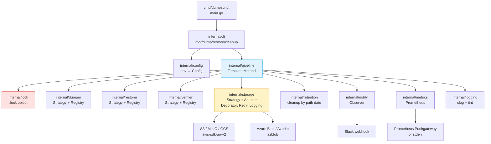

# Architecture

How `dumpscript` is organised — packages, design patterns, and the shape of
the pipelines.

---

## High-level flow



---

## Packages

| Package | Responsibility |
|---|---|
| `cmd/dumpscript` | `main.go` — wires Cobra root and subcommands |
| `internal/cli` | Subcommand definitions (`dump`, `restore`, `cleanup`) |
| `internal/config` | Loads env vars, validates, provides `*Config` |
| `internal/pipeline` | `Dump` and `Restore` orchestration (Template Method) |
| `internal/dumper` | Strategy per engine, self-registration via `init()` |
| `internal/restorer` | Strategy per engine |
| `internal/verifier` | Strategy per engine for content verification |
| `internal/storage` | S3 + Azure backends with Retry/Logging decorators |
| `internal/lock` | Day-level `.lock` object + `ExecutionID` |
| `internal/retention` | Parses date from object path, deletes ≥ cutoff |
| `internal/notify` | Slack Observer (+ Noop) |
| `internal/metrics` | Prometheus client (Pushgateway + stderr emit) |
| `internal/logging` | Configures `slog` with tint for console/JSON output |
| `internal/awsauth` | IRSA `WebIdentityRoleProvider` |
| `internal/clock` | Injectable time source for testable code |
| `internal/xerrors` | `errors.Join`-style helpers (`First`, dual wrap) |

---

## Dump pipeline sequence

```mermaid
sequenceDiagram
    autonumber
    participant C as CronJob pod
    participant P as pipeline.Dump
    participant S as Storage
    participant D as Dumper
    participant V as Verifier
    participant N as Notifier
    participant M as Metrics

    C->>P: Run(ctx)
    P->>P: generate ExecutionID
    P->>N: EventStart
    P->>S: List(prefix)  (reachability preflight)
    alt unreachable
        P->>N: EventFailure
        P-->>C: error "destination unreachable"
    end
    P->>S: Exists(lockKey)
    alt locked
        P->>N: EventSkipped
        P-->>C: exit 0  (skipped, not a failure)
    end
    P->>S: UploadBytes(lockKey, info JSON)
    Note over P: defer Release(lock) — fires on panic/return
    opt RETENTION_DAYS > 0
        P->>S: cleanup old objects
    end
    P->>D: Dump(ctx) — engine-specific → gzip → file
    P->>D: Artifact.Verify() — gzip envelope
    P->>V: Verify(ctx, path) — per-engine content
    P->>S: Upload(local, key)
    P->>M: record(size, duration, outcome)
    P->>S: Delete(lockKey) — via defer
    P->>N: EventSuccess
    P-->>C: exit 0
```



---

## Design patterns

| Pattern | Where |
|---|---|
| **Strategy** | `dumper.Dumper`, `restorer.Restorer`, `verifier.Verifier`, `storage.Storage` |
| **Self-registering Factory** | `dumper.Register` / `restorer.Register` / `verifier.Register` called from each engine file's `init()` |
| **Template Method** | `pipeline.Dump.Run`, `pipeline.Restore.Run` |
| **Adapter** | `storage.S3` (aws-sdk-go-v2), `storage.Azure` (azblob) |
| **Decorator** | `storage.Retrying` (exponential backoff), `storage.Logging` |
| **Observer** | `notify.Notifier` (Slack & Noop) |
| **Command** | Each Cobra subcommand |
| **Builder** | `dumper.ArgBuilder` |
| **Functional Options** | `storage.NewS3(..., WithCredentialsProvider(...))` |

Deep dive: [Design patterns](./development/design_patterns.md).

---

## Why self-registration

Adding a new engine is **one file plus one init() call** — no central switch
statement to update. Example from `internal/dumper/redis.go`:

```go
func init() {
    Register(config.DBRedis, func(cfg *config.Config, log *slog.Logger) Dumper {
        return NewRedis(cfg, log)
    })
}
```

`Register` is idempotent (later calls overwrite — useful in tests) and
thread-safe (`sync.RWMutex`). `New` is a pure map lookup. There is **no
hardcoded `switch` on `DBType` anywhere** in factory code.

---

## Lock guarantees

`defer Release(lock)` is placed immediately after `Acquire` in the pipeline
body. Go's `defer` semantics guarantee the lock is released on:

- normal return (success)
- error return
- `panic` anywhere below
- `context.Done()` triggered mid-flight

A unit test (`TestDumpPipeline_PanicInDumper_StillReleasesLock`) explicitly
verifies the panic case.

The only way a lock can orphan is an **external kill** (`SIGKILL` / pod OOM /
node crash) — the `.lock` JSON payload records `hostname`, `PID`, and
`started_at` precisely so an operator can identify and clear stale locks.

More: [Locking](./features/locking.md).

---

## Content verification

Two layers:

1. **Envelope**: `Artifact.Verify` opens the gzip file, reads 512 bytes,
   confirms the CRC/ISIZE trailer. Catches empty or invalid gzip.
2. **Content**: per-engine `Verifier.Verify` scans for a well-known footer or
   magic signature. Catches SIGKILL-truncated dumps that still produced a
   valid gzip.

Both run before the upload — a bad dump never reaches the bucket.

More: [Verification](./features/verification.md).

---

## Error handling

- **Sentinel errors** — stable values in `internal/pipeline/errors.go`
  (e.g. `ErrDumpFailed`, `ErrVerifyFailed`). Callers can `errors.Is` against
  them regardless of the underlying cause.
- **Dual wrap** — `%w: %w` (Go 1.20+) preserves both the sentinel and the
  original cause in a single error chain.
- **`xerrors.First`** — reduces the common `firstErr := …; if secondErr != nil …`
  boilerplate when closing readers/writers concurrently.

---

## Observability

Three complementary signals:

1. **Structured logs** (`slog`) — pretty console in dev, JSON in prod. One
   `execution_id` propagated through the whole run.
2. **Prometheus metrics** — `dumpscript_duration_seconds`,
   `dumpscript_artifact_bytes`, `dumpscript_result{outcome=…}`. Push to a
   Pushgateway or log to stderr for sidecar scraping.
3. **Slack events** — `start`, `success`, `failure`, `skipped`.

---

## Next

- [Adding a new engine](./development/adding_an_engine.md)
- [Design patterns deep dive](./development/design_patterns.md)
- [Testing](./operations/testing.md)
