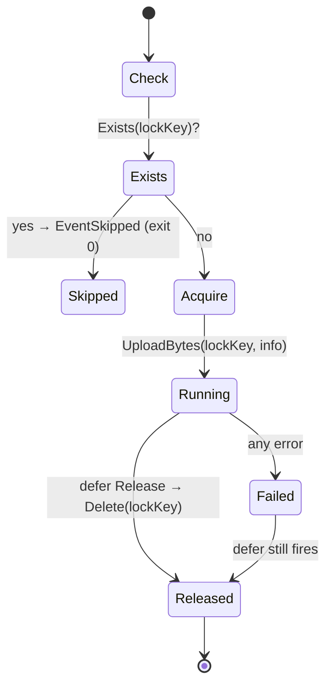

# Distributed locking

A day-level `.lock` object in object storage prevents concurrent dumps from
colliding.

---

## Why

A Kubernetes CronJob can fire twice if the node flaps, a pod gets
rescheduled, or you have clusters in multiple regions writing to the same
bucket. Without coordination you'd see:

- Two `pg_dump` processes running simultaneously → increased DB load.
- Two uploads racing for the same key → one overwrites the other.

The lock eliminates both.

---

## Shape

Written at:

```
<prefix>/<periodicity>/YYYY/MM/DD/.lock
```

Contents (JSON, synthetic example):

```json
{
  "execution_id": "a1b2c3d4e5f60718",
  "hostname":     "backup-worker-3",
  "pid":          42,
  "started_at":   "2026-04-23T12:00:00Z"
}
```

The payload is for **forensics** — identifying orphaned locks from
long-dead pods. The existence check does not parse the payload.

---

## Semantics



### Guarantees (all unit-tested in `internal/pipeline/dump_test.go`)

- Lock is **released on success**.
- Lock is **released on dump, verify, upload errors**.
- Lock is **released on panic** (Go `defer` semantics).
- Lock contention → **exit 0 + Slack `skipped`**, not a failure alert.

### Non-guarantees

A `SIGKILL` / pod OOM / node crash leaves a stale lock. The JSON payload
records `hostname`, `PID`, and `started_at` so an operator can decide:

```sh
aws s3 cp s3://my-backups/pg/daily/YYYY/MM/DD/.lock - | jq .
# inspect hostname / pid / age → clear with:
aws s3 rm s3://my-backups/pg/daily/YYYY/MM/DD/.lock
```

---

## Race-free acquire

The lock acquire uses a **read-then-write** sequence. Two pods arriving
within the same 20 ms window could both see "no lock" and both try to
`PutObject`. Whoever lands second overwrites the first; neither error is
raised.

This is acceptable: both pods would then run `pg_dump` in parallel (a few
seconds wasted), but the lock still prevents a third pod and the final
artefacts use unique keys (`dump_<timestamp>.sql.gz` — timestamp includes
seconds).

For strict mutual exclusion under split-brain, supplement with a
distributed coordinator (etcd / Consul / ZooKeeper) — out of scope here.

---

## Lock granularity

- **Daily** → one lock per day per prefix.
- **Weekly** → one lock per 7-day period.
- **Monthly** → one per month.

So you can safely have a daily dump in one cluster and a weekly dump in
another, using the same bucket — their lock paths don't overlap.

---

## Slack alert: `EventSkipped` (not failure)

When the lock exists, the pipeline:

1. Logs `another backup in progress`.
2. Emits Slack `EventSkipped` (`color: warning`).
3. Exits **0** — because "skipped" is not a failure.

This prevents alert fatigue when you have overlapping schedules.

---

## Back

- [Docs home](../README.md)
- [Architecture — lock guarantees](../architecture.md#lock-guarantees)
