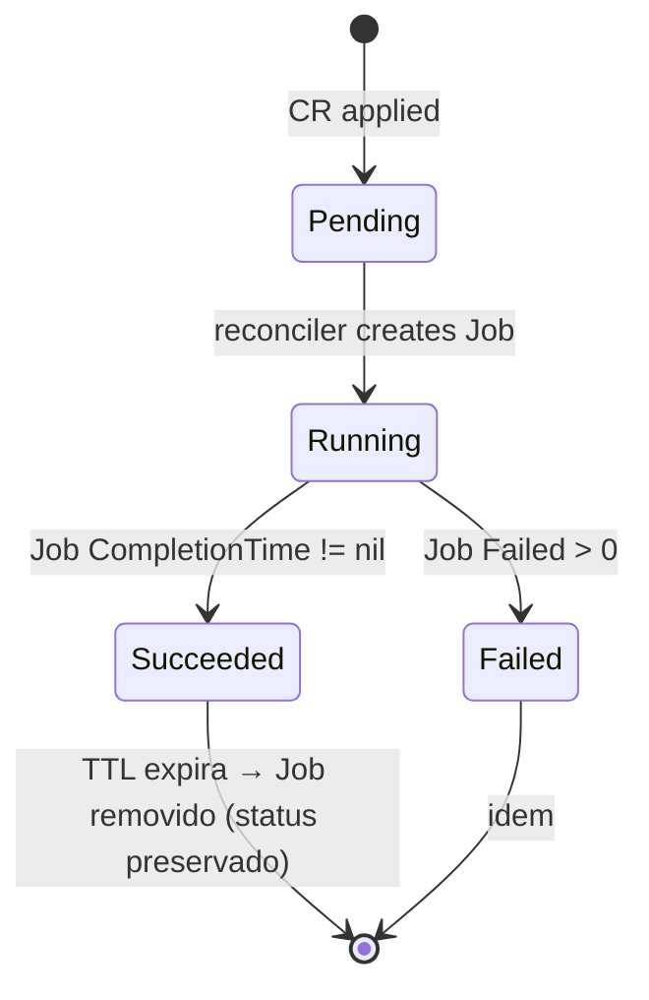

# `Restore` reference

CRD `Restore` (`dumpscript.cloudscript.com.br/v1alpha1`) — restore one-shot
declarativo. O reconciler cria uma `batch/v1.Job` espelhando o spec e
atualiza `status.phase` ao longo do ciclo de vida.

Re-aplicar o mesmo CR é idempotente; pra restaurar o mesmo dump de novo,
use um `metadata.name` diferente.

---

## Spec

| Campo | Tipo | Default | Descrição |
|---|---|---|---|
| `sourceKey` | string | required | Object key completo dentro do bucket (ex: `pg/daily/YYYY/MM/DD/dump_*.sql.gz`) |
| `database` | DatabaseSpec | required | DB destino (mesmo shape do `BackupSchedule.spec.database`) |
| `storage` | StorageSpec | required | Backend de origem (mesmo shape do `BackupSchedule.spec.storage`) |
| `createDB` | bool | `false` | Emite `CREATE DATABASE` antes do restore (Postgres/MySQL/MariaDB). No-op pra Mongo/CRDB |
| `notifications` | NotificationsSpec | — | Notificadores |
| `image` | string | `ghcr.io/cloudscript-technology/dumpscript:latest` | Override |
| `serviceAccountName` | string | — | KSA pra IRSA/WI |
| `ttlSecondsAfterFinished` | *int32 | `86400` (24h) | TTL do Job pós-conclusão |

`database` / `storage` / `notifications` têm o mesmo shape do
`BackupSchedule` — ver [BackupSchedule reference](./backupschedule.md#databasespec).

---

## Status

| Campo | Tipo | Atualizado por |
|---|---|---|
| `phase` | enum | reconciler — `Pending` \| `Running` \| `Succeeded` \| `Failed` |
| `jobName` | string | nome do `batch/v1.Job` criado |
| `startedAt` | *metav1.Time | quando o Job começou |
| `completedAt` | *metav1.Time | quando terminou (success ou fail) |
| `message` | string | mensagem curta humana, populada em failure |
| `conditions` | []metav1.Condition | padrão K8s |

`kubectl get restore` mostra via printcolumn:

```
NAME                              PHASE       ENGINE       SOURCE                                                    STARTED      COMPLETED
pg-staging-restore-from-prod      Succeeded   postgresql   pg/daily/2026/04/26/dump_20260426_020000.sql.gz           2026-04-27   2026-04-27
```

---

## Lifecycle



- **Idempotência**: o reconciler usa nome determinístico do Job
  (`restore-<cr-name>`); re-apply do mesmo CR não duplica.
- **TTL**: `ttlSecondsAfterFinished` controla quando o Job filho é
  garbage-collected. O CR `Restore` em si não é deletado — fica
  acessível pra `kubectl describe` indefinidamente.
- **Owner reference**: o Job tem ownerRef apontando pro CR; deletar o
  CR remove o Job + pod imediatamente.

---

## Engine-specific gotchas

| Engine | Detalhe |
|---|---|
| **Redis** | Não suportado — retorna `ErrRedisRestoreUnsupported` (RDB precisa stop+replace+restart). |
| **etcd** | Não suportado — `etcdctl snapshot restore` rebuilda data-dir, requer coordenação multi-node. |
| **Cockroach** | DB destino **deve pré-existir**; `createDB: true` é no-op (CRDB não aceita CREATE DATABASE no replay). |
| **MongoDB** | `createDB: true` é redundante (Mongo cria collections sob demanda). |
| **ClickHouse** | Tabela destino **deve pré-existir** com schema compatível (Native format não preserva DDL). |
| **Neo4j** | DB precisa estar **stopped** (Community Edition limitation). |
| **SQLite** | Cria o arquivo se não existir. |

---

## Examples

| Sample | Cenário |
|---|---|
| [restore-postgres.yaml](../../examples/operator/restore-postgres.yaml) | + `createDB: true` |
| [restore-mongodb-create-db.yaml](../../examples/operator/restore-mongodb-create-db.yaml) | Atlas roundtrip |
| [restore-cockroach.yaml](../../examples/operator/restore-cockroach.yaml) | DB destino pré-criado |

---

## Back

- [Operator overview](./README.md)
- [BackupSchedule reference](./backupschedule.md)
- [Secret refs](./secret-refs.md)
