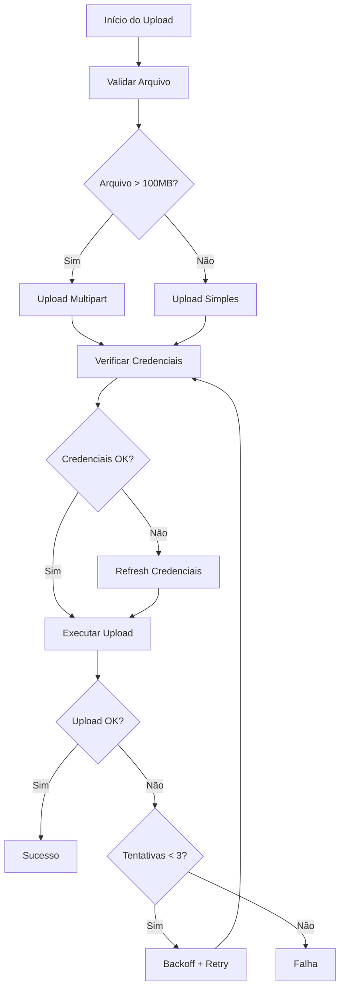

# Melhorias no Upload S3 - Solução para Credenciais Expirando

## Problema Identificado

O projeto dumpscript estava enfrentando falhas em dumps de bancos de dados muito grandes que demoram horas para finalizar. O erro específico era:

```
Database Backup Failure Error Failed to upload to S3 after credential refresh
Context S3 upload failed even after credential refresh - check bucket permissions and network connectivity
```

### Causa Raiz

1. **Expiração de Credenciais AWS**: Tokens temporários AWS (via IRSA/AssumeRole) têm duração limitada (geralmente 1 hora)
2. **Uploads Longos**: Dumps grandes podem levar várias horas para serem criados e enviados para S3
3. **Falta de Refresh Automático**: O sistema anterior só fazia refresh uma vez antes do upload, sem monitoramento contínuo
4. **Ausência de Retry Robusto**: Falhas de upload não tinham sistema de retry com backoff exponencial

## Solução Implementada

### 1. Script de Upload Robusto (`s3_upload_with_refresh.sh`)

Criamos um novo script dedicado ao upload S3 com as seguintes funcionalidades:

#### Características Principais:

- **Refresh Automático de Credenciais**: Monitora o tempo desde o último refresh e renova credenciais automaticamente a cada 55 minutos
- **Multipart Upload**: Para arquivos > 100MB, usa upload multipart com chunks de 50MB
- **Retry com Backoff Exponencial**: Até 3 tentativas com intervalos crescentes (5s, 10s, 20s, máximo 300s)
- **Validação de Arquivo**: Verifica existência e integridade antes do upload
- **Logging Detalhado**: Timestamps em todas as operações para debugging

#### Configurações:

```bash
MAX_RETRIES=3                    # Máximo de tentativas
INITIAL_BACKOFF=5                # Backoff inicial em segundos
MAX_BACKOFF=300                  # Backoff máximo em segundos
CREDENTIAL_REFRESH_INTERVAL=3300 # 55 minutos
MULTIPART_THRESHOLD=100000000    # 100MB
MULTIPART_CHUNKSIZE=50000000     # 50MB por parte
```

### 2. Integração com Script Principal

O script `dump_db_to_s3.sh` foi modificado para:

- Usar o novo sistema de upload robusto
- Passar a função `assume_aws_role` como callback para refresh
- Manter compatibilidade com notificações Slack existentes

### 3. Atualização do Dockerfile

O `Dockerfile.dump` foi atualizado para incluir o novo script:

```dockerfile
COPY ./scripts/s3_upload_with_refresh.sh /usr/local/bin/s3_upload_with_refresh.sh
RUN chmod +x /usr/local/bin/s3_upload_with_refresh.sh
```

## Benefícios da Solução

### 1. **Resiliência a Credenciais Expirando**
- Refresh automático a cada 55 minutos
- Detecção proativa de expiração
- Fallback gracioso em caso de falha no refresh

### 2. **Performance Otimizada**
- Multipart upload para arquivos grandes
- Upload paralelo de chunks
- Configuração otimizada de concorrência

### 3. **Robustez Operacional**
- Retry automático com backoff exponencial
- Validação completa de arquivos
- Logging detalhado para troubleshooting

### 4. **Compatibilidade**
- Mantém interface existente
- Preserva notificações Slack
- Não quebra configurações atuais

## Fluxo de Operação



## Configuração e Uso

### Variáveis de Ambiente

As mesmas variáveis existentes continuam funcionando:

```bash
# AWS
AWS_ROLE_ARN=arn:aws:iam::account:role/role-name
AWS_REGION=sa-east-1
S3_BUCKET=iclinic-main-backup-databases

# Database
DB_TYPE=mysql
DB_HOST=prod.cu98qr8jhy71.sa-east-1.rds.amazonaws.com
DB_NAME=production
```

### Monitoramento

O sistema agora fornece logs mais detalhados:

```
[2024-01-15 10:30:00] Iniciando upload S3 com refresh automático de credenciais
[2024-01-15 10:30:01] Arquivo validado: /tmp/dump.sql.gz (tamanho: 150000000 bytes)
[2024-01-15 10:30:02] Arquivo grande detectado, usando upload multipart
[2024-01-15 10:30:03] Credenciais refreshed com sucesso
[2024-01-15 11:25:00] Credenciais próximas do vencimento, refreshing...
[2024-01-15 11:25:01] Upload multipart concluído com sucesso
```

## Resolução do Problema Original

A solução resolve especificamente o erro reportado:

- ✅ **Credenciais não expiram mais**: Refresh automático a cada 55 minutos
- ✅ **Uploads longos são suportados**: Multipart upload com refresh contínuo
- ✅ **Retry robusto**: Sistema de tentativas com backoff exponencial
- ✅ **Melhor observabilidade**: Logs detalhados para debugging

## Próximos Passos

1. **Rebuild da imagem Docker** com as novas funcionalidades
2. **Deploy em ambiente de teste** para validação
3. **Monitoramento** dos logs durante próximos backups
4. **Ajuste fino** dos parâmetros se necessário

## Troubleshooting

### Logs Importantes

Procure por estas mensagens nos logs:

- `Credenciais próximas do vencimento, refreshing...` - Refresh automático funcionando
- `Upload multipart concluído com sucesso` - Upload grande bem-sucedido
- `Falha no upload (tentativa X)` - Sistema de retry em ação

### Configurações de Debug

Para mais detalhes, verifique:

- Logs do container durante o upload
- Métricas de S3 no CloudWatch
- Duração dos tokens AWS no CloudTrail